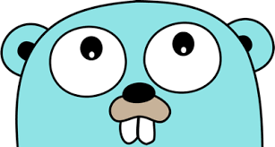

<h1 align="center">
📄 README
</h1>

## Practice Golang!
<h1 align="center">
      
</h1>

## Description

This project has the porpuse to build hands-on activities with Golang language programing  to understand the basic concepts of this language, such as:

- Project Structure; 
- Functions, ForLoop, Types and Variable;
- Testing, 
- Struct;
- Maps;
- Interface;
- Go Routines;
- Channels

## Info: 

**This Project was based on Udemy course [Go: The Complete Developer's Guida](https://www.udemy.com/course/go-the-complete-developers-guide/):**

---

## 🍜 Licença

Esse projeto está sob licença. Veja o arquivo [LICENÇA](LICENSE.md) para mais detalhes. 
